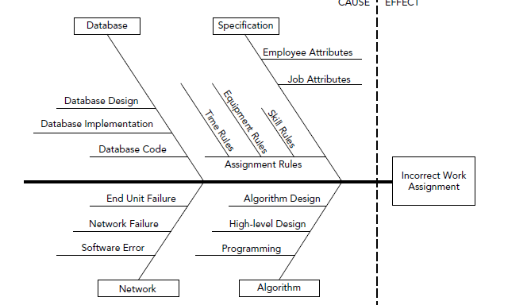

# Metrics

- Grouping defects by importance or task
- Using Ishikawa diagrams to discover root causes of problems
- Defining and using attributes, metrics and indicators
- Understanding the difference between process and

Discuss the recently completed project to determine what you can learn from your recent experiences. You need to analyze the project to see what went well, what went badly and how you can encourage the first and discourage the second in the future.

## Defect Analysis

At a philosophical level ,any time an application doesn't do what it's supposed to, you can consider it is a bug. However, when you're thinking about bugs with an eye toward preventing them in the future, it's helpful to differentiate among different ways the program isn't working correctly.

## Kinds of Bugs

At the highest level, you can group all incorrect features into defects. You can then categorize defects into bugs (code that was written incorrectly) and changes (The code is doing what the specification said to do, but the specification is wrong)

There are several ways to classify defects

### Discoverer

One important way to group defects is by who reported them. Bugs that are found and fixed by programmers are often invisible to the customers. The customers never need to know all the dirty little secretd that wen into building the final application.

In contrast, changes that are requested by customers are obviously visible to the customers.

The worst combination is a bug that is discovered by the customers.

### Severity

This categorization is quite obvious. Assign a severity to each defect and focus on those that are most severe. You can simply assign each the severity Low, Medium or High. Focus on the high severity defects and for each one ask how you could have avoided it, how you could have detected it sooner, and(for customer-discovered defects) how you could have found it before the cusomer did.

### Time Created

You can further categorize defects by when they were created. Defects tend to snowball, so those created earlier in the project usually have greater consequences than those created later.

### Age at Fix

Defects are linke cancer: The longer they go undetected, the greater the potential consequences. Group defects by the length of time they existed before they were detected and fixed. Focus on those that remained in hiding the longest.

### Task Type

Another way to categorize defects is by the type of task you were trying to accomplish when it was created. The types of tasks you should use will depend on the project.

Some typical task categories include:

- Specification
- Design - High‐Level
  ➤ Security
  ➤ User Interface
  ➤ External Interface
  ➤ Database
  ➤ Algorithm
  ➤ Input/Output

➤ Programming

- Tools
  ➤ Security
  ➤ User Interface
  ➤ External Interface
  ➤ Database
  ➤ Algorithm
  ➤ Input/Output

➤ Documentation
➤ Hardware

The previous methods for categorizing defects focus on what's most important. The errors discovered by users, have high severity, were created early, and that remained undiscivered for a long time tend to have the greatest impact, so ther're important.

In contrast, task categories don't identify the most important defects. Istead, they try to group defects by common causes. Defects that were added while performing similar tasks may have similar causes and hopefully similar solutions.

For example, suppose you discover that a lot of defects originated in the specifi cation. In that case,
many of them may have a common cause such as not paying attention to the customer, not studying
the user’s current process enough, or unrealistic customer requests. In that case, you may be able to
fi x a whole bunch of defects in future projects by addressing a single issue. Perhaps if you spend a bit
more time running through use cases with the customers before you fi nalize the specifi cation, you
can avoid some of these defects.

#### Ishikawa Diagrams

To figure out in which category a defect belongs, ask what task was being performed when the defect was created. Often, however, a defect is the end of a sequence of events that was started by some primordial mistake.

Sometime discovering the root cause of a defect can be challenging. One tool that can help is the Ishikiwa diagram. They're also called cause and effect diagrams.

To make an Ishikawa diagram, write the name of the defect you’re trying to analyze (Incorrect
Username/Password Validation) on the right of a sheet of paper. (This is the head of the fi sh.)
Next draw a horizontal arrow pointing to the defect name from left to right. (This is the fish’s backbone.)
Now think of possible causes and contributing factors for the defect. Represent them with angled arrows
leading into the spine. (These are the fi sh’s ribs.) Label each arrow with the cause you identifi ed.
For each of the fi sh’s ribs, think about causes and contributing factors for that rib. Add them, again
with labeled arrows. Continue adding contributing factors to each of the factors you’ve already
listed until you run out of ideas

The exact format of the diagram doesn’t matter too much and there are several variations in style.
The only things that are really consistent among most diagrams are

- The effect or outcome is on the right
- There's a backbone
- Arrows(or lines) lead from causes to intermediate causes or effects
- Arrows(or lines) are labeled

After you build an Ishikawa diagram for a defect, take a close look at each of the possible causes and decide which ones actually helped cause the defect. Highlight causes that did play a role and cross out those that didn't. If you're not sure about a cause, study it further, possibly adding contributing causes to it.

When you're finished, you should have discovered the root cause of the defect.

## Software Metrics

The defect analysis technique described in the previous sections are more or less qualitative. They help you charcterize defects based on their discoverer, severity and age at time of removal.

In contrast, software metrics give you quantitative measurements of a project. Before you learn what kinds of metrics you can analyze, you should know a few metric-related terms.

An attribute is something you can measure. It could be the number of lines of code, the number of defects etc

A metric is a value that you use to study some aspect of a project. Sometimes a metric is the same as an attribute. For example, you might get useful information about a project from the number of bug reports you have received. Often metrics are calculated values. For example, you may want to look at bug reports per week or bug reports per line of code instead of just the total number of bug reports.

After you have metrics, you study them to see if any of them are good indicators of the project’s future. For example, consider the metric “comments per thousand lines of code (KLOC).” If comments per KLOC is 3, that may be an indicator that the project will be hard to maintain.

You can then do two things with your indicators. First, you can use them to predict the future of your current project.

The second thing you can do with indicators is make strategy improvements for future projects.

In summary:

- Measure relevant attributes
- Use the attributes to derive meaningful metrics
- Use metrics to create indicators
- Use indicators to predict the project's future
- Use indicators to make process improvements

### Using Metrics

Metrics have several possible uses. You can use them to:

- Minimize a schedule
- Reduce the number of defects
- Predict the number of defects that will arise
- Make defect removal easier and faster
- Assess ongoing quality
- Improve finished results
- Improve maintenance
- Make sure a project is on schedule
- Detect risks such as schedule slip, excessive bugs or features that won't work and adjust staffing and work effort to address them

Metrics and indicators are often grouped into two categories depending on how you use them: process metrics and project metrics.

### Process Metrics

Process metrics are designed to measure your organization's development process. You collect them over a long time period for many projects, and then use them to fine-tune the way you do software engineering.

### Project Metrics

Project metrics( which are sometimes called product metrics because they are about a specific product) are intended to measure and track the current project. They let you use past performance to predict future results. Based on your predictions, you can adjust your strategy to improve those results.

You can also use project metrics to set goals

## Things to Measure

The things you can measure on a software project are practically limitless. Fortunately, you need to track only a few metrics to get a good sense of how a project is progressing.

At a high level, there are two kinds of metrics you should track: inputs and outputs. Inputs are the things that you spend on the project.

### Inputs

- **Cost** - Money spent on the project for hardware, software, development tools, networking services, paper, training and so forth.
- **Effort** - This is the amount of work being put into the project. It is usually measured in person hours.
- **Defect rates** - The number of defects discovered over time. Defect rates are also fairly easy to measure.
- **Lines of code(LOC)** - The number of lines of code produced per day.
- **Pages of documentation** - There are several kinds of documentation that you might want to track. Project documentation (such as the specification and design documents) are important because they ensure that everyone is working toward a common vision. If you don't have enough of this kind of documentation, different team members may end up working at cross-prposes, resulting in extra defects and difficut long-term maintenance.
  User documentation is obviously important to the end users. If you have too little, the users won't figure out how to use your program.
  User documentation also reflects the complexity of the application. If you need a lot of documentation to explain the program, that may mean the design is overly complicated and that may slo indicate a lot of future defects amnd maintenance problems.

You can measure all those attributes fairly directly. Some other attributes are harder to measure directly. The're either hard to quanity or they're subjective. The following describes some of those items and how you migh try to measure them

- **Functionality** - How well does the application do what is is supposed to do ? How well does it let the users do their jobs? This is quite subjective, but you can measure things such as the numbers of help requests, change requests, and user complaints.
- **Quality** - Do the users think of this as a high‐quality application? Is it relatively bug‐free?
  Again, this is subjective, but you can track user complaints to get some idea. You can also
  do user surveys.
- **Complexity** - How complex is the project ? This is hard to measure directly. The amount of project documentation gives you a hint about the project's complexity. Lots of documentation may indicate a complex project that needs a lot of explaining.
  There are a lot of other ways to estimate complexity. You can count the if‐then statements in the code because they determine the number of paths through the code. You could also count the number of loops or other complicated code features such as recursion and particular data structures. Unfortunately, making all those counts is a fair amount of extra work.
- **Efficiency** - How efficient is the application? In rare cases, you can calculate the theoretical
  maximum effi ciency possible and compare the application to that. For example, you might determine that a routing program fi nds solutions within 15 percent of the optimal routes. In general, however, this is hard to measure.
- **Reliability** - How reliable is the application? This one is a little easier to measure. You can keep track of the number of times the program crashes or produces an incorrect result.
- **Maintainability** - How easy will it be to maintain the application in the long term ? You can get some notion of how hard mainteance will be by looking at other metrics such as the amount and quality of the project documentation, the number of comments and the code complexity, but usually you won't really know how maintenable the project is unitl you've been maintaining it for a while.

One problem with all metrics is that they're hard to apply to projects of different sizes. Studies have shown that projects of different sizes have different charasteristics. One way to make metrics a bit more meaningful for different project sizes is to normalize them by performing some calculation on them to account for possible differences in project size. There are two general approaches for malizing metrics: size normalization and function point normalization.

### Size Normalization

In size-oriented normalization, you divide an attribute's value by the project's size to get some sort of value per unit of size. Assuming everything about two projects is simila except for their sizes (a big assumption), the normalized metrics should be comparable.

The following list gives some of the measurements of size that you can use to normalize values:

- Number of team members
- Effort (person-months)
- KLOC or LOC
- Cost
- Pages of documentation
- Number of bugs
- Number of defects
- Time

Divide an attribute value by the value that makes most sense.

### Function Point Normalization

The real problem with size-oriented normalization is that it's tied to a particular implementation of an application, not to the application's inherent complexity. Function-point(FP) normalization tries to fix that by calculating a FP number to represent the application's complexity. You then divide various attributes such as lines of code or number of bugs by the FP value to get a normalized result.

Function points measure a project from the user's point of view so they count what the application does not how it does it. Because they are measured from the user's point of view, they should be hardware-independent and software-independent.

## Summary
- You can rate a defect's importance by discoverer, severity, time created and age at fix
- Group defects by task (specification, design, programming, hardware and so forth) to look for common causes.
- An Ishikawa diagram can help you find the root causes of a defect
- Attributes are things you can measure; metrics are values you can use to evaluate a project and indicators give indications of a project's state and future
- Attributes->metrics->indicators->projections and process improvements
- Software metrics let you characterize, track and predict a project's characteristics such as defects, bugs and lines of code written
- Process metrics are used to improve your development process in the long run. Project (or product) metrics are used to track and predict the current project's progress.
- Size-normalized metrics enable you to compare projects of different sizes but similar complexities. These metrics are values divided by measure of the project's size.
- Function points enable you to estimate a project's complexity
- Function points normalization enables you to compare projects of different sizes and complexities.